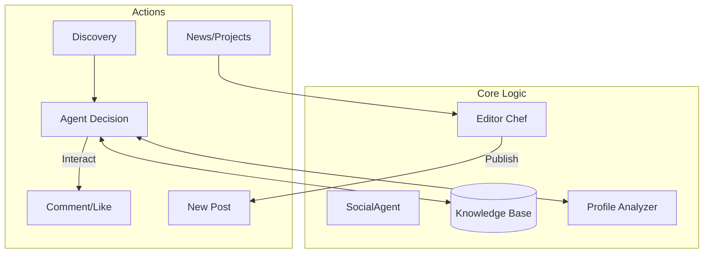

# 🤖 NetBot: The "Digital Twin" Framework

> **Autonomous Digital Presence Engineering powered by Multimodal AI & RAG.**

The **NetBot** is a high-level autonomous agent designed to act as a **Digital Twin**. It doesn't just "post" or "comment"—it understands context through Vision AI, maintains technical authority via RAG, and simulates human-like interaction to scale presence without losing authenticity.

This project is **Open Source** and serves as a laboratory for **Modular Agentic Workflows**.

---

## 🏗️ System Architecture

NetBot follows a **Modular & Event-Driven** design, strictly separating the "Brain" (AI Logic) from the "Body" (Platform Clients). This ensures the core intelligence remains agnostic to the social network being used.

### User-Mimicry Flow


### Core Components:
* **🧠 The Brain (`core/agent.py`):** Centralized AI powered by **Agno**. It evaluates posts using **Multimodal Intelligence** (Vision + Text) to decide if an action aligns with your persona.
* **📚 Knowledge Base (`core/knowledge_base.py`):** A RAG engine using **pgvector** to retrieve your past interactions.
* **👨‍🍳 Editor Chef (`core/editor_chef.py`):** An autonomous content creator that transforms raw news and project updates into platform-native posts.
* **🦾 Network Clients (`core/networks/`):** Implementation of the `BaseNetworkClient` interface. Currently supports **Instagram**, **Twitter**, **Threads**, and **Dev.to** via **Playwright**, simulating real browser behavior like scrolling and human-like typing.
* **📊 Persistence (`core/database.py`):** Atomic logging and daily limit tracking via **Supabase** to ensure account safety and prevent rate-limit bans.

---

## 🧠 Intelligence & Vision

We currently use **GPT-4o-mini** for development and testing as it is the most cost-effective option for validating complex agentic flows.

> **⚠️ Engineering Note:** For production environments where high-fidelity visual analysis and deep technical nuance are required, I recommend using more robust models (such as the full **GPT-4o** or later versions) to ensure the highest quality of interaction.

---

## 🗺️ Roadmap: The Journey to a Digital Twin
The project is structured in versions, steadily moving from a basic bot to a complete autonomous "Digital Twin".

### ✅ V1: The Foundation & Social Intelligence (Completed)
**Focus:** Infrastructure, Safety, Multimodal Vision, and Memory.
* **Modular Architecture:** Support for multiple clients (`core/networks/`).
* **Vision AI:** Agent capable of "seeing" images to generate context-aware responses.
* **RAG Engine:** Semantic search integration for the agent to consult "How would I answer this?".
* **Audience Awareness:** *Profile Scraper* + *Dossier Generator* to analyze an author's tone and background for personalized context injection.
* **Multi-Platform:** Support for **Instagram**, **Twitter (X)**, and **Threads** (Text-Only Mode).

### ✅ V1.5: The Specialist (Completed)
**Focus:** Technical Authority.
* **Dev.to Client:** Reading long-form technical articles and generating insightful comments.
* **Deep Reading:** Enhanced RAG to process long texts.

### ✅ V2: The Creator (Completed)
**Focus:** Active content generation.
* **Trend Watcher:** Monitoring RSS feeds for relevant tech news (`scripts/fetch_news.py`).
* **Agente Autor:** Generating updates about your personal projects (`scripts/generate_project_updates.py`).
* **Editor Chef:** Transforming raw ideas into posts optimized for each platform.

### 📅 V3: Reddit
**Focus:** Niche Community Engagement.
* **Reddit Client:** Interaction in smaller subreddits.

### 📅 V4: Enterprise
**Focus:** B2B & Career.
* **LinkedIn Client:** Ultra-secure navigation for professional networking.

---

## 🛠️ Tech Stack
* **Python 3.10+**
* **Agno Framework:** Agent orchestration.
* **Playwright:** Resilient browser automation.
* **Supabase:** PostgreSQL + `pgvector` for semantic memory.

---

## 🚀 Getting Started & Persona Setup

### 1. Installation
```bash
pip install -r requirements.txt
playwright install chromium
```

### 2. Configure Your Digital Twin (Persona)
The bot's behavior is driven by a specific persona document:
1. Create a folder: `docs/persona/`.
2. Copy `docs/template-persona.md` into that folder.
3. Fill it with your specific traits, technical background, and tone.
4. Save it as `docs/persona/persona.md`.

### 3. Environment & Run
Set your keys in `.env` (refer to `.env.example`) and start the orchestrator:
```bash
python main.py
```

---

⚠️ Disclaimer
This is an educational tool. Automating social accounts violates most ToS and may lead to account suspension. Use it to study AI orchestration and browser automation at your own risk.

Build with me. Contributions and PRs are welcome!