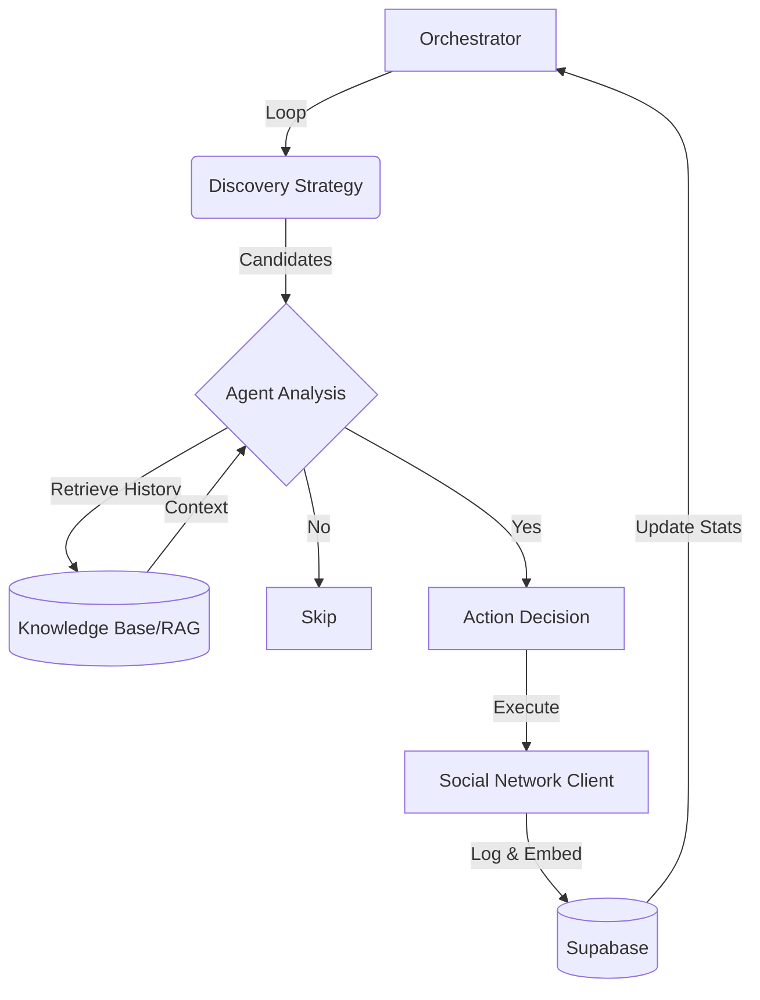

# 🤖 NetBot: The "Digital Twin" Framework

> **Autonomous Digital Presence Engineering powered by Multimodal AI & RAG.**

The **NetBot** is a high-level autonomous agent designed to act as a **Digital Twin**. It doesn't just "post" or "comment"—it understands context through Vision AI, maintains technical authority via RAG, and simulates human-like interaction to scale presence without losing authenticity.

This project is **Open Source** and serves as a laboratory for **Modular Agentic Workflows**.

---

## 🏗️ System Architecture

NetBot follows a **Modular & Event-Driven** design, strictly separating the "Brain" (AI Logic) from the "Body" (Platform Clients). This ensures the core intelligence remains agnostic to the social network being used.

### Logic Flow


### Core Components:
* **🧠 The Brain (`core/agent.py`):** Centralized AI powered by **Agno**. It evaluates posts using **Multimodal Intelligence** (Vision + Text) to decide if an action aligns with your persona.
* **📚 Knowledge Base (`core/knowledge_base.py`):** A RAG engine using **pgvector** to retrieve your past interactions. This ensures the bot's opinions and tone evolve like a real "Digital Twin".
* **🦾 Network Clients (`core/networks/`):** Implementation of the `BaseNetworkClient` interface. Currently supports Instagram via **Playwright**, simulating real browser behavior like scrolling and human-like typing.
* **📊 Persistence (`core/database.py`):** Atomic logging and daily limit tracking via **Supabase** to ensure account safety and prevent rate-limit bans.

---

## 🧠 Intelligence & Vision

We currently use **GPT-4o-mini** for development and testing as it is the most cost-effective option for validating complex agentic flows.

> **⚠️ Engineering Note:** For production environments where high-fidelity visual analysis and deep technical nuance are required, I recommend using more robust models (such as the full **GPT-4o** or later versions) to ensure the highest quality of interaction.

---

## 🗺️ Roadmap: The Journey to a Digital Twin

The project is structured in phases, moving from basic infrastructure to high-level social empathy and cross-platform authority.

### 🟢 Phase 0: The Foundation (Completed)
**Focus:** Infrastructure, Safety, and Vision.
* **Modular Design:** Core structure defined to support multiple social clients.
* **Vision AI:** Agent capable of "seeing" images to generate context-aware responses.
* **Discovery:** Hybrid strategy (VIP lists + Hashtags) successfully implemented.

### 🚧 Phase 1: The "Digital Twin" (Current Focus)
**Focus:** Memory and Social Empathy.
* **Knowledge Base (RAG):** Semantic search integration for the agent to consult "How would Guilherme answer this?".
* **Audience Awareness:** Developing a *Profile Scraper* to analyze target bios and recent posts to generate a "Dossier" for personalized interaction.
* **Text Expansion:** Initial support for **Threads** and **X (Twitter)**.

### 📅 Phase 2: The Specialist
**Focus:** Long-form content and technical authority.
* **Deep Reading:** Scaling RAG to process and discuss technical articles from **Dev.to** or **Medium**.
* **Community Engagement:** Expanding the "Digital Twin" presence to platforms like **Reddit**.

### 📅 Phase 3: The Creator & Enterprise
**Focus:** Active content generation and B2B.
* **Trend Watcher:** Monitoring GitHub Trending and Hacker News to initiate original discussions.
* **LinkedIn Client:** Ultra-secure navigation focused on professional networking and lead triaging.

---

## 🛠️ Tech Stack
* **Python 3.10+**
* **Agno Framework:** Agent orchestration.
* **Playwright:** Resilient browser automation.
* **Supabase:** PostgreSQL + `pgvector` for semantic memory.

---

## 🚀 Getting Started & Persona Setup

### 1. Installation
```bash
pip install -r requirements.txt
playwright install chromium
```

### 2. Configure Your Digital Twin (Persona)
The bot's behavior is driven by a specific persona document:
1. Create a folder: `docs/persona/`.
2. Copy `docs/template-persona.md` into that folder.
3. Fill it with your specific traits, technical background, and tone.
4. Save it as `docs/persona/persona.md`.

### 3. Environment & Run
Set your keys in `.env` (refer to `.env.example`) and start the orchestrator:
```bash
python main.py
```

---

⚠️ Disclaimer
This is an educational tool. Automating social accounts violates most ToS and may lead to account suspension. Use it to study AI orchestration and browser automation at your own risk.

Build with me. Contributions and PRs are welcome!