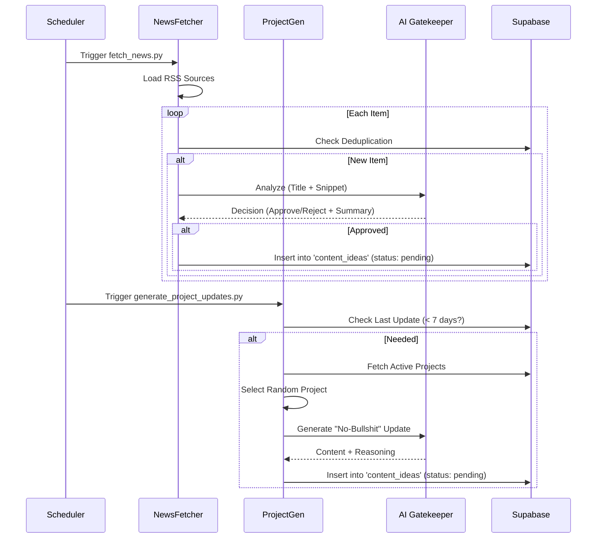
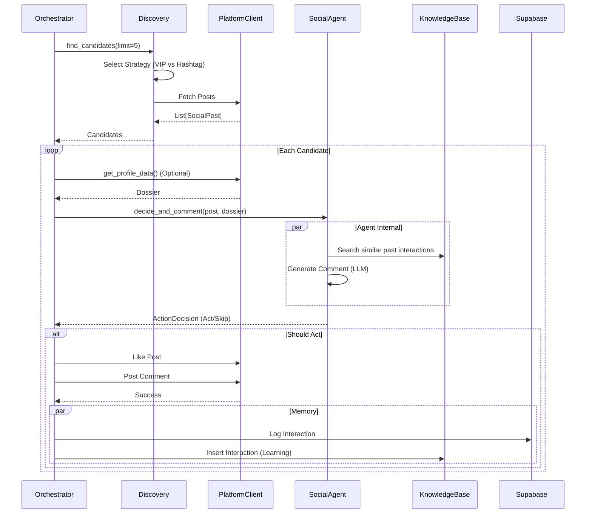

# NetBot System Architecture

> [!NOTE]
> This document reflects the current state of the NetBot system as of Feb 2026.

## 1. System Overview

NetBot is an omnichannel social media AI agent designed to act as an autonomous, high-quality engagement bot. It mimics a specific human persona, discovering relevant content across multiple platforms (Twitter, Instagram, Dev.to, Threads) and interacting with it intelligently using RAG (Retrieval-Augmented Generation) and LLMs.

## 2. Architecture Diagram

```mermaid
graph TD
    subgraph "Entry Points"
        CLI[netbot.py (CLI)]
        Main[main.py (Orchestrator)]
    end

    subgraph "Core Logic"
        Agent[SocialAgent (Agno + GPT-4o)]
        RAG[(Knowledge Base / PgVector)]
        DB[(Supabase DB)]
        Profile[Profile Analyzer]
        Editor[Editor Chef]
    end

    subgraph "Network Layer"
        IG[Instagram Client]
        TW[Twitter Client]
        TH[Threads Client]
        DT[Dev.to Client]
    end

    Main -->|Loop| IG & TW & TH & DT
    Main -->|Updates| CLI
    
    IG & TW & TH & DT -->|Fetch Posts| Agent
    Agent <-->|Context| RAG
    Agent -->|Decision| Main
    Main -->|Action| IG & TW & TH & DT
    Main -->|Log| DB
    
    classDef storage fill:#f9f,stroke:#333,stroke-width:2px;
    class DB,RAG storage;
```

## 3. Core Components

### 3.1 Orchestrator (`main.py`)
The central nervous system. It runs an infinite loop (`run_cycle`) that:
1.  **Checks Triggers**: Fetches news (`NewsFetcher`) and generates project updates (`ProjectUpdateGenerator`).
2.  **Iterates Configured Platforms**: Processes enabled networks sequentially.
3.  **Enforces Limits**: Checks daily interaction limits in Supabase before acting.
4.  **Manages Resources**: Handles browser startup/shutdown via `BrowserManager`.

### 3.2 The "Brain" (`core/agent.py`)
Encapsulated in `SocialAgent`.
-   **Model**: GPT-4o-mini via `agno`.
-   **Persona**: Loaded from `docs/persona/persona.md`.
-   **Decision Making**: `decide_and_comment(post, dossier)` method analyzes content + context + image to output a structured `ActionDecision`.
-   **Memory (RAG)**: Stores past interactions in `NetBotKnowledgeBase` (PgVector) to avoid repetition and maintain consistency.

### 3.3 Network Layer (`core/networks/`)
Each platform (Twitter, Instagram, etc.) follows a standard pattern:
-   **Client**: Handles low-level interaction (Login, Like, Comment, Post).
    -   *Implementation*: Hybrid. Uses Playwright for browsing/posting (human-like) and APIs (Tweepy) where available/safe.
-   **Discovery**: `DiscoveryStrategy` implementation.
    -   *Logic*: Randomly selects between **VIP Lists** (monitoring specific users) and **Hashtags** (searching topics) defined in JSON configs.

### 3.4 Data & State (`core/database.py`)
-   **Supabase**: Primary persistent storage.
    -   `interactions`: Logs of every comment/like.
    -   `daily_stats`: Tracks usage limits.
    -   `content_ideas`: Pool for generated content.
-   **Local State**:
    -   `browser_state/`: Stores browser cookies/sessions (JSON) to persist logins across restarts.

---

## 6. Detailed Process Flows

### 6.1 Content Curation Flow
**Goal**: Populate the `content_ideas` pool with high-quality, relevant data to be published later.



### 6.2 Publication Flow (Editor Chef)
**Goal**: Transform pending ideas into platform-native posts and publish them.

```mermaid
graph TD
    Start[Cycle Start] --> CheckLimits{Can Publish Today?}
    CheckLimits -- No --> End[Skip]
    CheckLimits -- Yes --> Select{Select Content}
    
    Select -->|Project Day| GetProject[Fetch Project Update]
    Select -->|Normal Day| GetNews[Fetch News/Insight]
    
    GetProject & GetNews --> HasContent{Found Idea?}
    HasContent -- No --> End
    HasContent -- Yes --> Transform[AI Transformation Agent]
    
    Transform -->|Input: Idea| AI
    AI -->|Output: SocialCopy| Review
    
    subgraph AI Logic
        direction TB
        P[Persona]
        Rules[Platform Rules]
        Context[Source Content]
        P & Rules & Context --> Gen[Generate Post]
    end
    
    Review{Dry Run?}
    Review -- Yes --> Log[Log to Console]
    Review -- No --> Publish[Client.post_content()]
    
    Publish --> Success{Success?}
    Success -- Yes --> DBUpdate[Update DB: status='published']
    Success -- No --> Error[Log Error]
```

### 6.3 Discovery & Interaction Cycle
**Goal**: Engage with the community by commenting on relevant posts.


