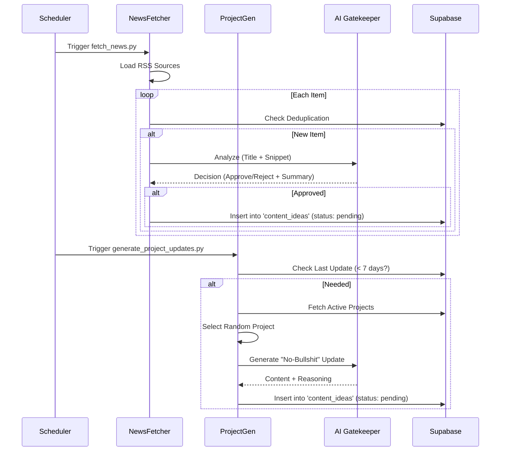
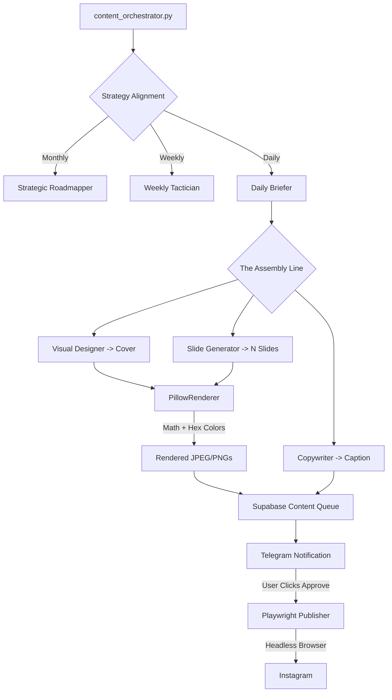
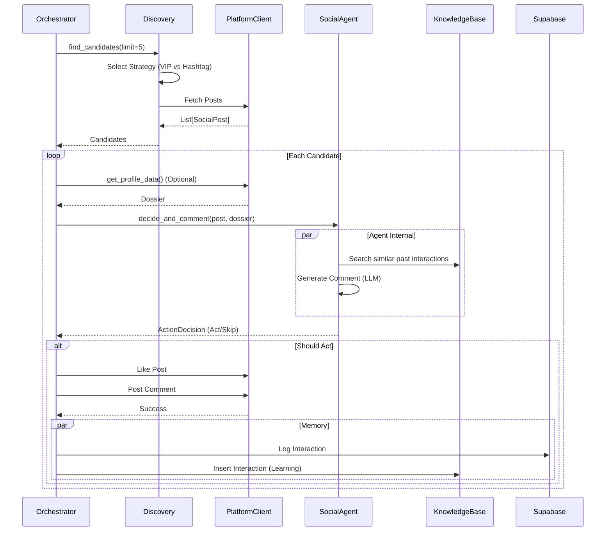

# NetBot System Architecture

> [!NOTE]
> This document reflects the current state of the NetBot system as of Feb 2026.

## 1. System Overview

NetBot is an omnichannel social media AI agent designed to act as an autonomous, high-quality engagement bot. It mimics a specific human persona, discovering relevant content across multiple platforms (Twitter, Instagram, Dev.to, Threads) and interacting with it intelligently using RAG (Retrieval-Augmented Generation) and LLMs.

## 2. Architecture Diagram

```mermaid
graph TD
    subgraph "Entry Points"
        CLI[netbot.py (CLI)]
        Main[main.py (Orchestrator)]
        Cascade[scripts/content_orchestrator.py]
    end

    subgraph "Core Reaction Logic (V1)"
        Agent[SocialAgent (Agno)]
        RAG[(PgVector Memory)]
        Profile[Profile Analyzer]
    end

    subgraph "Active Content Cascade (V2)"
        Roadmap[Strategic Roadmapper]
        Tactician[Weekly Tactician]
        Brief[Daily Briefer]
        Makers[Design / Copy / Slides / Render]
        Approve[Telegram In-the-Loop]
    end

    subgraph "Publishers & Networks"
        PW[Playwright Publisher]
        IG[Instagram Client]
        TW[Twitter Client]
    end

    Cascade --> Roadmap --> Tactician --> Brief --> Makers
    Makers --> Approve --> PW
    
    Main -->|Fetch| IG & TW
    IG & TW --> Agent <--> RAG
```

## 3. Core Components

### 3.1 Content Orchestrator (`scripts/content_orchestrator.py`)
The autonomous content machine (V2). Runs daily to generate high-quality visual + text assets via a multi-agent assembly line.
1.  **Strategists**: Calculates Monthly Theme > Weekly Topic > Daily Briefing.
2.  **Makers**: Translates the briefing into JSON payloads, visual covers, rendered carousel slides (`PillowRenderer`), and conversational copy.
3.  **Approval**: Pings the owner via Telegram. Waits for an active `approve` callback.
4.  **Publishing**: Directly hands the approved content to a headless `PlaywrightInstagramPublisher`.

### 3.2 Main Interaction Loop (`main.py`)
The community engagement loop (V1). Runs continuously to consume the infinite feed.
1.  **Iterates Configured Platforms**: Processes enabled networks sequentially (Twitter, Threads, etc.).
2.  **Enforces Limits**: Checks daily interaction limits in Supabase before acting.

### 3.3 The "Brain" (`core/agent.py`)
Encapsulated in `SocialAgent`.
-   **Model**: GPT-4o-mini via `agno`.
-   **Persona**: Loaded from `docs/persona/brand.md`.
-   **Decision Making**: analyzes content + context + image to output a structured `ActionDecision`.
-   **Memory (RAG)**: Stores past interactions in `NetBotKnowledgeBase` (PgVector) to avoid repetition and maintain consistency.

### 3.3 Network Layer (`core/networks/`)
Each platform (Twitter, Instagram, etc.) follows a standard pattern:
-   **Client**: Handles low-level interaction (Login, Like, Comment, Post).
    -   *Implementation*: Hybrid. Uses Playwright for browsing/posting (human-like) and APIs (Tweepy) where available/safe.
-   **Discovery**: `DiscoveryStrategy` implementation.
    -   *Logic*: Randomly selects between **VIP Lists** (monitoring specific users) and **Hashtags** (searching topics) defined in JSON configs.

### 3.4 Data & State (`core/database.py`)
-   **Supabase**: Primary persistent storage.
    -   `interactions`: Logs of every comment/like.
    -   `daily_stats`: Tracks usage limits.
    -   `content_ideas`: Pool for generated content.
-   **Local State**:
    -   `browser_state/`: Stores browser cookies/sessions (JSON) to persist logins across restarts.

---

## 6. Detailed Process Flows

### 6.1 Content Curation Flow
**Goal**: Populate the `content_ideas` pool with high-quality, relevant data to be published later.



### 6.2 The Content Cascade (V2 Autopilot)
**Goal**: From blank canvas to published post via sequential specialized AI chains and programmatic rendering.



### 6.3 Discovery & Interaction Cycle
**Goal**: Engage with the community by commenting on relevant posts.


