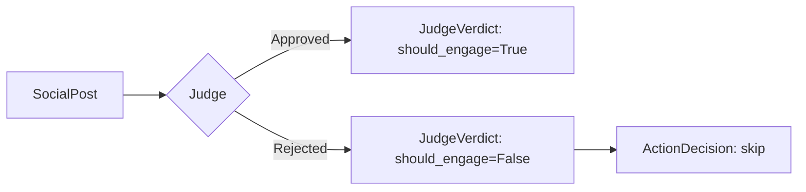
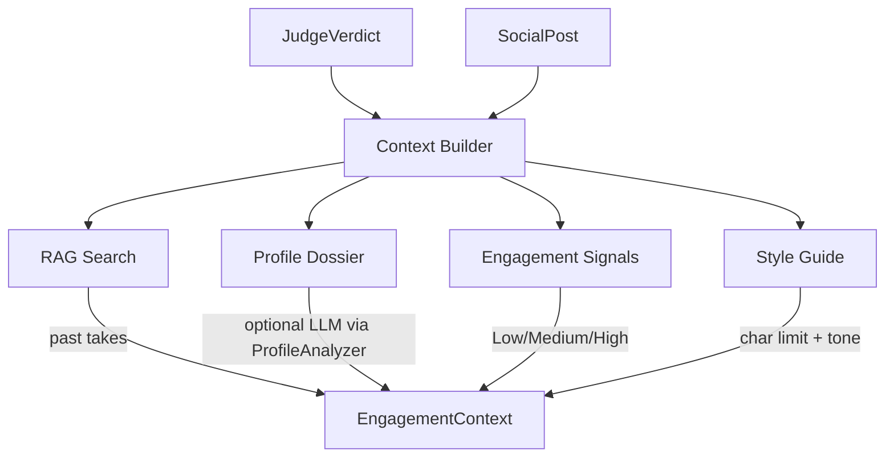
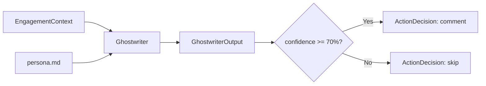
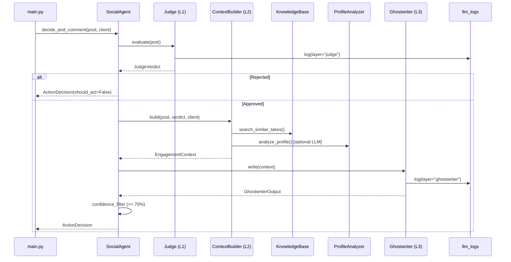

# Sequential Chain Architecture

## Overview

The NetBot engagement pipeline uses a **3-layer sequential chain** to process social media posts. This architecture replaces the monolithic `decide_and_comment` function with specialized layers that each have a clear responsibility.

```
┌──────────────────────────────────────────────────────────────────────┐
│                     SocialAgent.decide_and_comment(post, client)     │
│                                                                      │
│  ┌───────────────┐     ┌────────────────────┐     ┌───────────────┐  │
│  │   Layer 1     │     │   Layer 2          │     │   Layer 3     │  │
│  │   THE JUDGE   │────▶│   CONTEXT BUILDER  │────▶│  GHOSTWRITER  │  │
│  │               │     │                    │     │               │  │
│  │  🤖 LLM Call  │     │  🐍 Pure Python    │     │  🤖 LLM Call  │  │
│  │  ~300 tokens  │     │  (No LLM cost)     │     │  ~1500 tokens │  │
│  └───────────────┘     └────────────────────┘     └───────────────┘  │
│         │ rejected                                                   │
│         ▼                                                            │
│   ActionDecision(should_act=False)                                   │
└──────────────────────────────────────────────────────────────────────┘
```

### Why Sequential Chain?

| Problem (Before) | Solution (After) |
|---|---|
| Single monolithic LLM call with ~2000 tokens per post | Lightweight Judge rejects irrelevant posts for ~300 tokens |
| Full persona loaded even for rejected posts | Persona only loaded in Layer 3 (approved posts only) |
| RAG + Dossier computed before knowing if post is relevant | Context only assembled for approved posts |
| No visibility into _why_ a post was rejected vs approved | Each layer logs separately to `llm_logs` table |

---

## Layer 1: The Judge (`core/chains/judge.py`)

**Role**: Semantic filter — cheaply decides if a post is worth engaging with.

**Model**: `gpt-4o-mini` (minimal prompt, no persona)



### Input
- Post content, author, platform, media type.

### System Prompt (Summary)
- **APPROVE**: Tech, AI, engineering, coding, career in tech, open source.
- **REJECT**: Finance, politics, religion, sales, memes, motivational.
- Detects post language (ISO code: `pt-br`, `en`, `es`).

### Output: `JudgeVerdict`
| Field | Type | Description |
|---|---|---|
| `should_engage` | `bool` | True if the post passes the filter |
| `category` | `PostCategory` | Technical, Career, Networking, Opinion, Other |
| `language` | `str` | Detected language code (`pt-br`, `en`, etc.) |
| `reasoning` | `str` | Why approved/rejected |

### Token Cost
~300 tokens per call. **This is the only cost for rejected posts.**

---

## Layer 2: Context Builder (`core/chains/context_builder.py`)

**Role**: Pure Python aggregator — NO LLM cost (except optional ProfileAnalyzer).

Only executes if the Judge approved the post. Assembles all context into a structured `EngagementContext` object.



### Data Sources

| Source | How | LLM? |
|---|---|---|
| **RAG** | `KnowledgeBase.search_similar_takes()` | No (vector search) |
| **Dossier** | `ProfileAnalyzer.analyze_profile()` | Yes (gpt-4o-mini) |
| **Engagement** | Post metrics (reply_count, like_count) | No |
| **Comments** | Existing comments on the post | No |
| **Style** | Platform-specific rules | No |

### Engagement Signal Logic
| Condition | Signal | Strategy |
|---|---|---|
| `reply_count > 10` | **High** | Join the flow, reply to specific points |
| `reply_count > 0` | **Medium** | Add constructive perspective |
| `reply_count == 0` | **Low** | Kickstart — be provocative but polite |

### Output: `EngagementContext`
A Pydantic model with all assembled data, ready for the Ghostwriter.

---

## Layer 3: The Ghostwriter (`core/chains/ghostwriter.py`)

**Role**: Comment generator — uses full persona context.

**Model**: `gpt-4o-mini` (full persona + behavior guidelines)



### System Prompt (Summary)
- Full persona loaded from `docs/persona/persona.md`.
- **OPINION OVER SOLUTION**: Hot takes, not debugging help.
- **NO GENERIC PRAISE**: No "Great design clarity!" etc.
- **Negative constraints**: Banned phrases list.
- **Language matching**: Reply in the detected language from Judge.
- **Consistency**: Match tone from past interactions (RAG).

### Prompt Template
The Ghostwriter receives a structured prompt built from `EngagementContext`:
```
## POST ({platform})
Author: @{username}
Content: "{content}"
Category: {category} | Language: {language}

## SIGNALS
Engagement: {signal} ({replies} replies, {likes} likes)
Strategy: {strategy}

## TARGET AUDIENCE DOSSIER
{dossier data if available}

## PAST INTERACTIONS (CONSISTENCY CHECK)
{RAG results if available}

## EXISTING COMMENTS
{comments if available}
---
Write the comment. Max {char_limit}. Style: {style_guide}.
```

### Output: `GhostwriterOutput`
| Field | Type | Description |
|---|---|---|
| `comment_text` | `str` | The generated comment |
| `confidence_score` | `int` | 0-100 confidence rating |
| `reasoning` | `str` | Why this tone/content was chosen |

---

## Full Pipeline Flow



---

## Token Cost Analysis

| Scenario | Before (Monolithic) | After (Sequential Chain) | Savings |
|---|---|---|---|
| **Post rejected** | ~2000 tokens | ~300 tokens (Judge only) | **~85%** |
| **Post approved (no dossier)** | ~2000 tokens | ~300 + ~1500 = ~1800 tokens | ~10% |
| **Post approved (with dossier)** | ~2800 tokens | ~300 + ~800 + ~1500 = ~2600 tokens | ~7% |

Since the bot typically rejects **60-80%** of discovered posts, the net token savings are **~50-65% across a full cycle**.

---

## LLM Logging

Each LLM call (Judge, ProfileAnalyzer, Ghostwriter) logs independently to the `llm_logs` table with a `layer` key in the metadata field:

```json
{
  "layer": "judge",       // or "ghostwriter"
  "post_id": "abc123",
  "platform": "linkedin",
  "author": "techguru42",
  "verdict": true         // Judge-specific
}
```

This gives full observability into each stage of the pipeline.

---

## File Structure

```
core/
├── agent.py                  # Orchestrator (Sequential Chain runner)
├── chains/
│   ├── __init__.py
│   ├── judge.py              # Layer 1: Semantic Filter
│   ├── context_builder.py    # Layer 2: Context Aggregator (Python)
│   └── ghostwriter.py        # Layer 3: Comment Generator
├── knowledge_base.py         # RAG (used by Context Builder)
├── profile_analyzer.py       # Dossier (used by Context Builder)
└── models.py                 # Pydantic schemas
```
